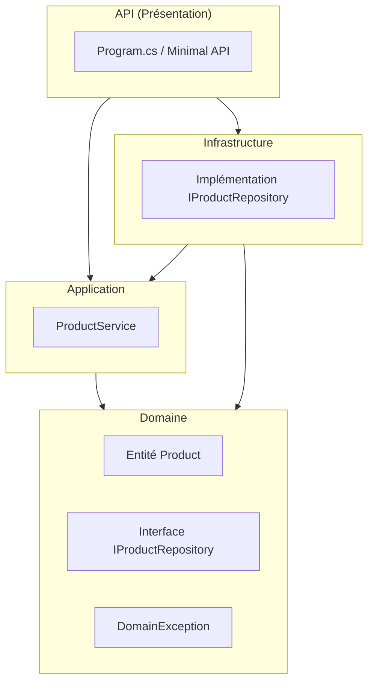
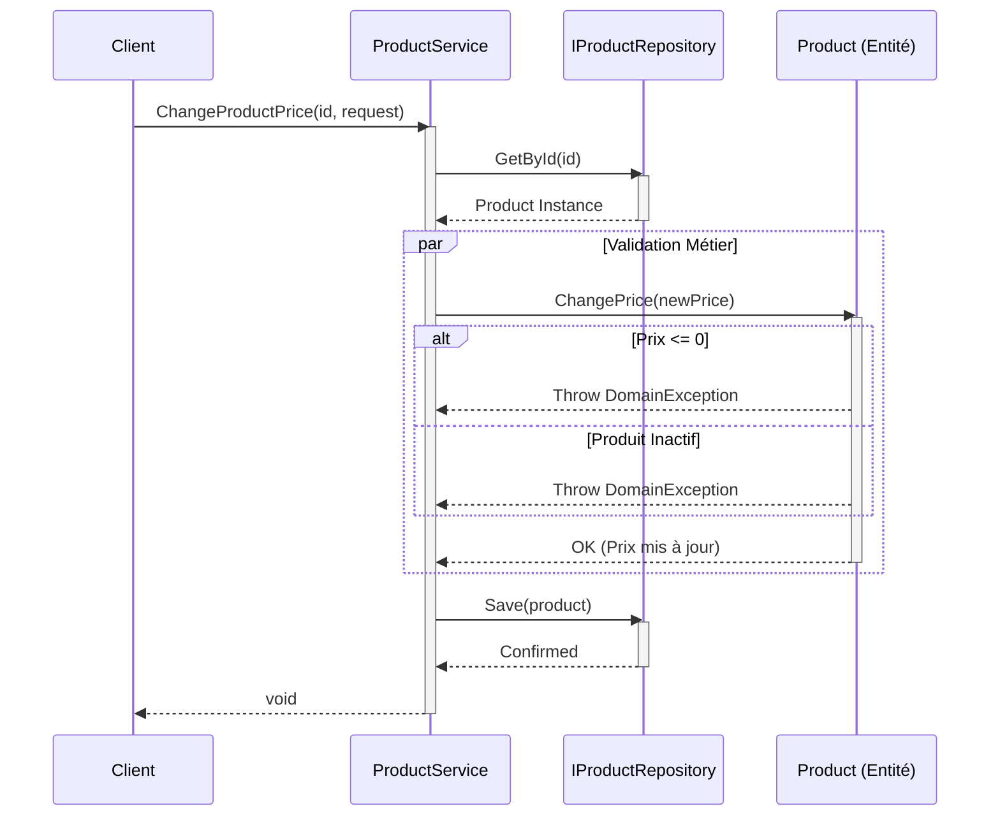

# Documentation Technique

## 1. Introduction

Ce document présente la documentation technique détaillée du projet **AdvencedDevSample**. Il s'agit d'une application .NET 8 modulaire démontrant les pratiques de développement avancées, notamment la Clean Architecture et le Domain-Driven Design (DDD).

## 2. Contexte

Le projet a pour but de fournir un squelette robuste pour des applications d'entreprise. Il met en œuvre une logique métier isolée et testable.
**État actuel** :

- Le cœur métier (**Domain**) gère les produits et leurs règles de validité.
- La couche **Application** expose des services pour manipuler ces produits.
- L'**API** est initialisée avec .NET 8 Minimal API (exemple WeatherForecast) et est prête à intégrer les endpoints métier.

## 3. Architecture

L'architecture est divisée en 4 couches concentriques respectant la règle de dépendance (l'intérieur ne connaît pas l'extérieur).

### Diagramme d'Architecture



### Détails des Composants

#### 1. Domain (Cœur)

Contient la logique pure.

- **Entité `Product`** :
  - Propriétés : `Id`, `Price`, `IsActive`.
  - **Invariants** :
    - Un prix ne peut pas être négatif ou nul.
    - On ne peut pas changer le prix d'un produit inactif.
  - **Exceptions** : `DomainException` est levée en cas de violation de règle métier.
- **Interfaces** : `IProductRepository` définit le contrat de persistance (`GetById`, `Save`).

#### 2. Application

Orchestre les cas d'utilisation sans logique métier complexe.

- **`ProductService`** :
  - Méthode `ChangeProductPrice(Guid, ChangePriceRequest)` : Récupère le produit, invoque la méthode métier `ChangePrice`, et sauvegarde.
  - Gère les exceptions de type `ApplicationServiceException` si le produit n'est pas trouvé.

#### 3. Infrastructure

(En cours de développement) Destinée à contenir l'implémentation d'accès aux données (par exemple Entity Framework Core).

#### 4. API

Point d'entrée HTTP.

- Utilise **ASP.NET Core Minimal APIs**.
- Configuration OpenApi intégrée pour la documentation Swagger.

## 4. Fonctionnement

### Flux Métier : Changement de Prix

Le diagramme ci-dessous illustre la séquence d'appels lorsqu'un service demande un changement de prix. C'est le cœur de la logique actuelle.



## 5. Procédure

### Environnement Technique

- **SDK** : .NET 8.0
- **IDE recommandé** : Visual Studio 2022 ou VS Code (avec C# Dev Kit).

### Installation et Exécution

1.  **Cloner le projet**

    ```bash
    git clone https://github.com/TAKARROUHT-Hamza/3il_AdvencedDev_C-.git
    ```

2.  **Restaurer les dépendances**

    ```bash
    dotnet restore
    ```

3.  **Lancer l'API**

    ```bash
    cd AdvencedDevSample.API
    dotnet run
    ```

    L'API sera accessible (par défaut) sur `http://localhost:5000` ou `https://localhost:5001`.

4.  **Lancer les Tests**
    Le projet contient des tests unitaires (`AdvencedDevSample.test`) validant la logique métier.
    ```bash
    dotnet test
    ```

## 6. Annexes

- **[Détails API](api/README.md)** : Description des endpoints HTTP disponibles.
- **Dossier Interface** : Réservé pour les futures maquettes ou contrats UI.
