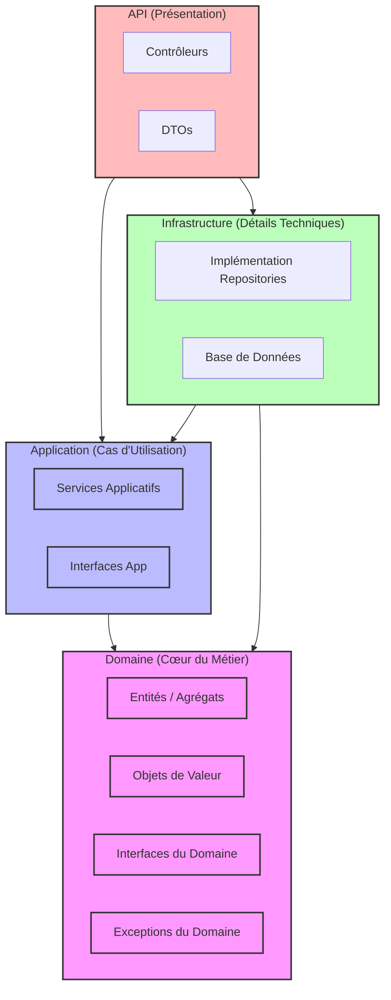
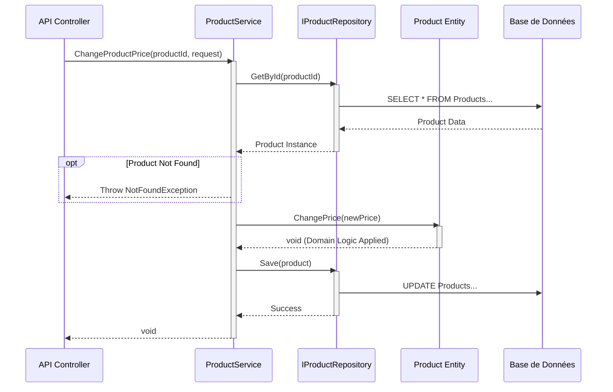

# Documentation Technique

## 1. Introduction

Ce document présente la documentation technique du projet **AdvencedDevSample**. Il détaille l'architecture, le fonctionnement interne, ainsi que les procédures d'installation et de déploiement. Ce projet sert d'exemple avancé de développement en C# .NET, illustrant des pratiques professionnelles modernes.

## 2. Contexte

Le projet **AdvencedDevSample** a été conçu pour démontrer l'application des principes de **Clean Architecture** et de **Domain-Driven Design (DDD)** dans un environnement .NET. L'objectif est de fournir une base solide, maintenable et testable pour des applications d'entreprise complexes. Il met en jeu des concepts tels que la séparation des préoccupations, l'inversion de dépendance et la gestion centralisée du domaine métier.

## 3. Architecture

Le projet respecte scrupuleusement les couches de la Clean Architecture. Les dépendances pointent toutes vers le centre (le Domaine), garantissant que la logique métier n'est couplée à aucun framework externe ou détail d'infrastructure.

### Diagramme d'Architecture



### Description des Couches

1.  **Domain (Cœur)** : Contient les règles métier pures (Entités comme `Product`, Value Objects). Aucune dépendance externe.
2.  **Application** : Orchestre les cas d'utilisation (ex: `ProductService`). Elle définit les interfaces que l'infrastructure doit implémenter.
3.  **Infrastructure** : Implémente les interfaces définies par le domaine/application (ex: Accès base de données, appels API externes).
4.  **API (Présentation)** : Point d'entrée de l'application (Controllers REST), gère les requêtes HTTP et la sérialisation.

## 4. Fonctionnement

Cette section illustre le flux d'exécution d'une fonctionnalité clé du système : **la modification du prix d'un produit**.

### Diagramme de Séquence : Changement de Prix

Le diagramme suivant montre les interactions entre les différentes couches lors de l'appel à la méthode `ChangeProductPrice` dans le `ProductService`.



## 5. Procédure

### Prérequis

- .NET SDK 8.0 (ou version supérieure)
- Visual Studio 2022 ou VS Code

### Installation

1.  Cloner le dépôt :
    ```bash
    git clone <repository-url>
    ```
2.  Restaurer les paquets NuGet :
    ```bash
    dotnet restore
    ```

### Compilation

Pour compiler la solution complète :

```bash
dotnet build
```

### Tests

Lancer les tests unitaires et d'intégration :

```bash
dotnet test
```

## 6. Annexes

Pour des détails plus spécifiques, veuillez consulter les sous-dossiers suivants :

- [Documentation API](api/README.md) : Détails sur les endpoints REST et contrats de données.
- [Documentation Interfaces](interface/README.md) : Détails sur les interfaces utilisateur ou contrats de services externes.
